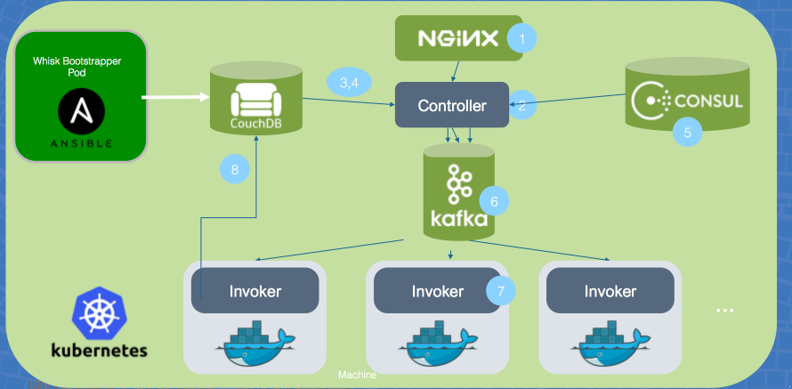

[](https://travis-ci.org/IBM/kubernetes-container-service-cassandra-deployment)

# Scalable OpenWhisk on Bluemix Container Service using Kubernetes

This code demonstrates the deployment of OpenWhisk on Kubernetes cluster. Apache OpenWhisk is a serverless, open source cloud platform that executes functions in response to events at any scale. As a developer there's no need to manage the servers that run your code. Apache OpenWhisk operates and scales your application for you. 

With IBM Bluemix Container Service, you can deploy and manage your own Kubernetes cluster in the cloud that lets you automate the deployment, operation, scaling, and monitoring of containerized apps over a cluster of independent compute hosts called worker nodes.  We can then leverage Bluemix Container Service using Kubernetes to deploy scalable OpenWhisk.



## Included Components
- [OpenWhisk](http://openwhisk.org/)
- [Kubernetes Clusters](https://console.ng.bluemix.net/docs/containers/cs_ov.html#cs_ov)
- [Bluemix container service](https://console.ng.bluemix.net/catalog/?taxonomyNavigation=apps&category=containers)
- [Bluemix DevOps Toolchain Service](https://console.ng.bluemix.net/catalog/services/continuous-delivery)

## Kubernetes Concepts Used

- [Kubenetes Pods](https://kubernetes.io/docs/user-guide/pods)
- [Kubenetes Services](https://kubernetes.io/docs/user-guide/services)
- [Kubernetes Jobs](https://kubernetes.io/docs/concepts/workloads/controllers/jobs-run-to-completion/)
- [Kubernets StatefulSets](https://kubernetes.io/docs/concepts/workloads/controllers/statefulset/)

## Prerequisite

Create a Kubernetes cluster with either [Minikube](https://kubernetes.io/docs/getting-started-guides/minikube) for local testing, or with [IBM Bluemix Container Service](https://github.com/IBM/container-journey-template) to deploy in cloud. The code here is regularly tested against [Kubernetes Cluster from Bluemix Container Service](https://console.ng.bluemix.net/docs/containers/cs_ov.html#cs_ov) using Travis.

## Deploy to Bluemix
If you want to deploy OpenWhisk directly to Kubernetes cluster on Bluemix,  click on 'Deploy to Bluemix' button below to create a Bluemix DevOps service toolchain and pipeline for deploying the WordPress sample, else jump to [Steps](#steps)

> You will need to create your Kubernetes cluster first and make sure it is fully deployed in your Bluemix account.

[](https://console.ng.bluemix.net/devops/setup/deploy/)

Please follow the [Toolchain instructions](https://github.com/IBM/container-journey-template/blob/master/Toolchain_Instructions.md) to complete your toolchain and pipeline.

The OpenWhisk will not be exposed on the public IP of the Kubernetes cluster. You can still access them by exporting your Kubernetes cluster configuration using `bx cs cluster-config <your-cluster-name>` and doing [Step 5](#5-using-cql) or to simply check their status `kubectl exec <POD-NAME> -- nodetool status`

## Prerquisites

- Kubernetes needs to be version 1.5+
- Kubernetes has Kube-DNS deployed
- (Optional) Kubernetes Pods can receive public addresses. This will be required if you wish to reach Nginx from outside of the Kubernetes cluster's network.

```Note: Use the following link to complete the instructions at the bottom
https://github.com/openwhisk/openwhisk-devtools/tree/master/kubernetes
```

## Steps

1. [Download OpenWhisk-Kubernetes codebase](#1-download-openWhisk-kubernetes-codebase)

### Quick Start

2. [Create OpenWhisk namespace](#2-create-openWhisk-namespace)
3. [Run Kubernetes Job to deploy OpenWhisk](#3-run-kubernetes-job-to-deploy-openwhisk)

### Manually deploying
4. [Build or use OpenWhisk Docker Images](#4-create-a-replication-controller)
5. [Create Kubernetes yaml files](#5-validate-the-replication-controller)
6. [Deplpy OpenWhisk on Kubernetes](#6-scale-the-replication-controller)

#### [Troubleshooting](#troubleshooting-1)


# 1. Download OpenWhisk Kubernetes codebase
Download the code needed to build and deploy OpenWhisk on Kubernetes

```
git clone https://github.com/openwhisk/openwhisk-devtools.git
```

# 2. Create OpenWhisk namespace

Once you are successfully targeted, you will need to create a create a namespace called openwhisk. To do this, you can just run the following command.

```
cd openwhisk-devtools/kubernetes
kubectl apply -f configure/openwhisk_kube_namespace.yml

```

# 3. Run Kubernetes Job to deploy OpenWhisk

First, we need to change a Cluster Role Binding to give permission for the job to run on Bluemix Kubernetes clusters. So, create a `permission.yaml` file with the following code.

```yaml
apiVersion: rbac.authorization.k8s.io/v1alpha1
kind: ClusterRoleBinding
metadata:
  name: openwhisk:admin
roleRef:
  apiGroup: rbac.authorization.k8s.io
  kind: ClusterRole
  name: cluster-admin
subjects:
- kind: ServiceAccount
  name: default
  namespace: openwhisk
```

Then, run the ClusterRoleBinding on your Kubernetes.

```
kubectl create -f permission.yaml
```

Next, Since the offical image has a different path for configuration script, run the following command to modify the command section in `configure/configure_whisk.yml` to the correct path.

```
#For OSX
sed -i '' s#openwhisk-devtools/kubernetes#incubator-openwhisk-deploy-kube# configure/configure_whisk.yml
#For Linux
sed -i s#openwhisk-devtools/kubernetes#incubator-openwhisk-deploy-kube# configure/configure_whisk.yml
```

Now, run the Kubernetes job to setup the OpenWhisk environment.

```
kubectl apply -f configure/configure_whisk.yml
```
The Kubernetes job under the covers pulls the latest docker image needed as a base, and then runs the configuration script

To see what is happening during the deployment process, you should be able to see the logs by running

```
kubectl -n openwhisk get pods #This will retrieve which pod is running the configure-openwhisk
kubectl -n openwhisk logs configure-openwhisk-XXXXX
```

As part of the deployment process, we store the OpenWhisk Authorization tokens in Kubernetes secrets. To use the secrets you will need to base64 decode them. So, run the following commands to retrieve your secret and decode it with base64.

```
kubectl -n openwhisk get secret openwhisk-auth-tokens -o yaml
export AUTH_SECRET=$(kubectl -n openwhisk get secret openwhisk-auth-tokens -o yaml | grep 'auth_whisk_system:' | awk '{print $2}' | base64 --decode)
```

Obtain the IP address of the Kubernetes nodes. You will need this to setup your OpenWhisk API host.

```
kubectl get nodes
```

Obtain the public port for the Kubernetes Nginx Service and note the port that used for the api endpoint

```
kubectl -n openwhisk describe service nginx
export WSK_PORT=$(kubectl -n openwhisk describe service nginx | grep https-api | grep NodePort| awk '{print $3}' | cut -d'/' -f1)
```
Now you should be able to setup the wsk cli like normal and interact with Openwhisk.

```
wsk property set --auth $AUTH_SECRET --apihost https://[kube_node_ip]:$WSK_PORT
wsk -i action invoke /whisk.system/utils/echo -p message hello --blocking --result 
```
> Note: Since your Kubernetes doesn't contain any IP SANs, you need to run your OpenWhisk actions with the insecure `-i` flag.

# 4. Build or use OpenWhisk Docker Images

## Troubleshooting

* If your Cassandra instance is not running properly, you may check the logs using
	* `kubectl logs <your-pod-name>`
* To clean/delete your data on your Persistent Volumes, delete your PVCs using
	* `kubectl delete pvc -l app=cassandra`
* If your Cassandra nodes are not joining, delete your controller/statefulset then delete your Cassandra service.
	* `kubectl delete rc cassandra` if you created the Cassandra Replication Controller
	* `kubectl delete statefulset cassandra` if you created the Cassandra StatefulSet
	* `kubectl delete svc cassandra`
* To delete everything:
	* `kubectl delete rc,statefulset,pvc,svc -l app=cassnadra`
	* `kubectl delete pv -l tpye=local`

## License

[Apache 2.0](http://www.apache.org/licenses/LICENSE-2.0)
